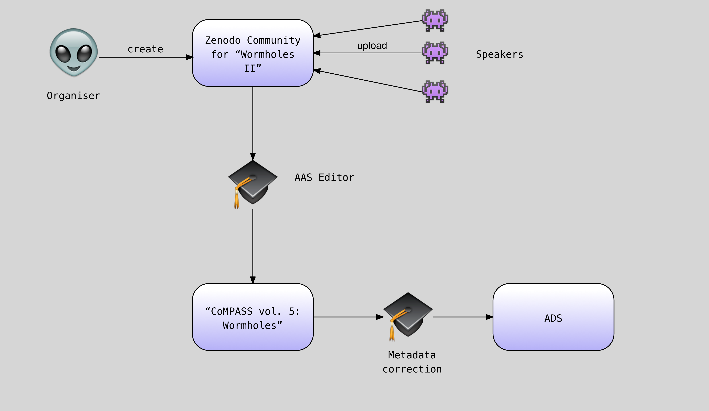

This is a proposed HOWTO contributed by an AAS/WGAS taskforce
describing how might use the CoMPASS workflow to have materials from a
conference or workshop published as a volume of the virtual Conference
& Meeting Proceedings of the AAS journal, including obtaining DoIs and
ADS indexing for citation. It will eventually transition out of this
documentation space.

Motivation
==========

Workshops and conferences now generate a wealth of information, most
of which do not create any printed proceedings. Sometimes these are
the only potentially citable sources of technical
information. Artifacts from such meetings (videos, slide
presentations, posters) are either not collected, or connected on
evanescent wiki sites. Even when there are published formally, they
often end up inaccessible behind paywalls - a particularly cruel irony
for open source licensed software often contributed on a volunteer
basis.

In late 2015, AAS and its Working Group on Astromical Software (WGAS)
organised a taskforce to develop a process to have meeting proceedings
easily converted into a virtual proceedings volume indexed by the
Astrophyics Data System (ADS).

If such a process were to be adopted, the AAS would guarantee the
preservation of these virtual proceedings. This document covers the
current implementation details, but these might substantially change
in the future. 

Workflows
=========

There are three principle actors in this workflow.

organiser
   The workshop organiser(s) or their proxy

speaker
   A speaker attending the conference and/or contributing
   material to the proceedings

editor
   The AAS Director of Publishing or their proxy
   
While artifacts that come out of a conference presentation are varied,
in this document we use three representational examples:

talk
   A presentation where there are multiple source materials, such as a
   video of the talk, and a slide presentation. 

poster
   A presentation where there is a single source material but perhaps
   with multiple renderings (eg. ppt and pdf).

paper
   A presentation resulting a paper that is prepared on a
   significantly different timescale than the conference. This paper
   may have been represented at the conference by another artifact
   (such as a talk or a poster) but the paper is considered a seperate
   artifact.

The following sections describe how publishing the virtual proceedings
for an imaginary Second Workshop on Wormholes. 

Poster
======

   

